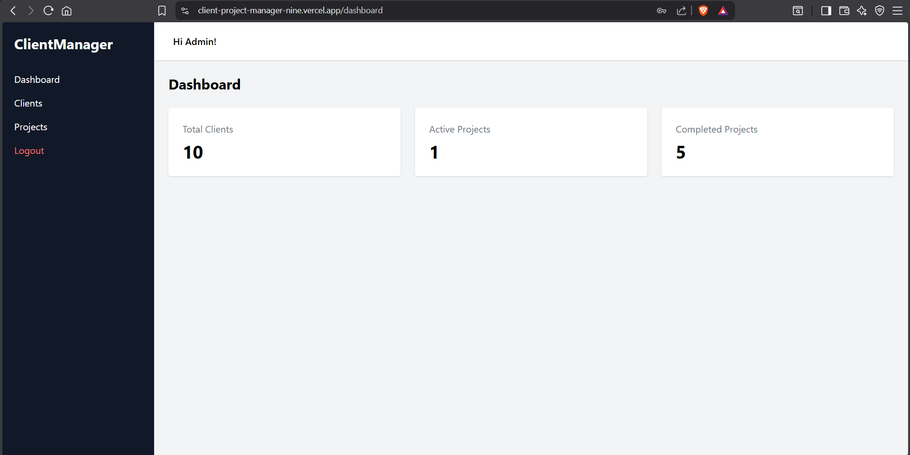
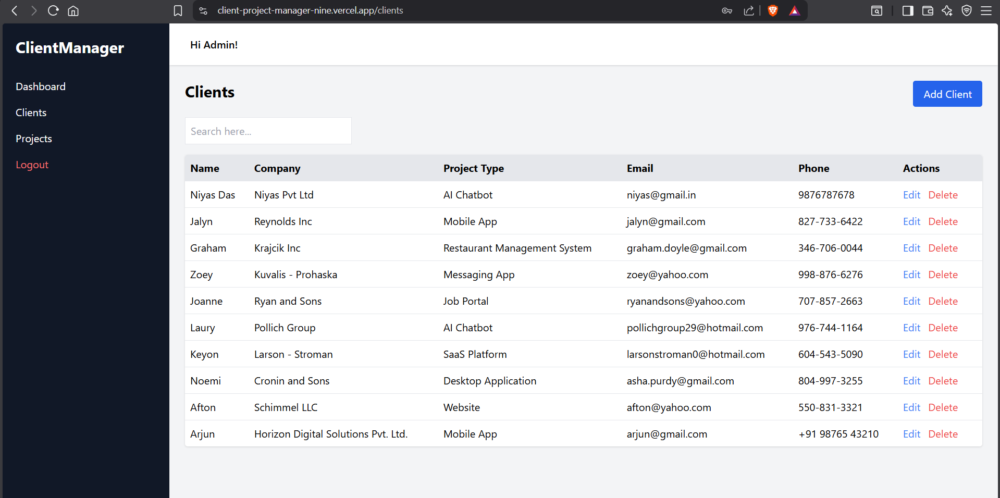
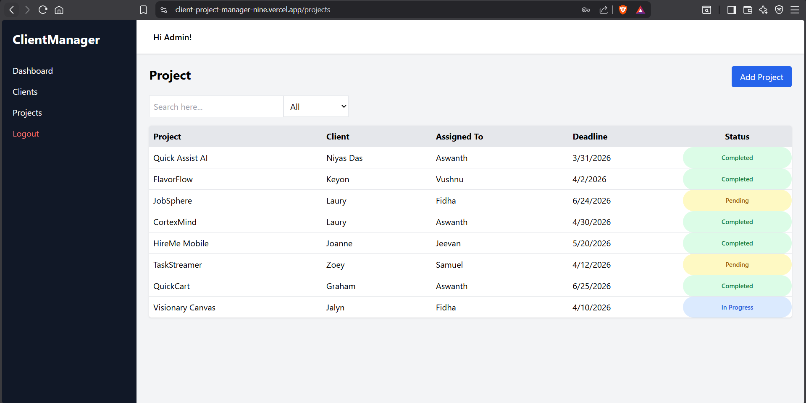
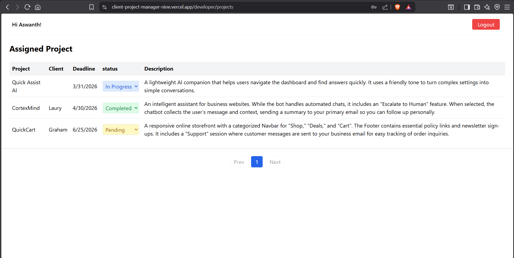

# Client Project Manager

Mini SaaS tool built for managing clients and their website projects inside a web agency. This project simulates a real workflow where an admin manages clients and projects while developers track their assigned work.

---

## 🌐 Live Demo

Frontend: [https://client-project-manager-nine.vercel.app](https://client-project-manager-nine.vercel.app)

API Base URL: [https://hdx-client-project-manager.onrender.com](https://hdx-client-project-manager.onrender.com)

Postman Documentation:
[https://documenter.getpostman.com/view/41845512/2sBXigNEGc](https://documenter.getpostman.com/view/41845512/2sBXigNEGc)

---

# 🚀 Project Overview

Client Project Manager is a full‑stack MERN application that helps a web agency organize client information and manage project assignments.

The system includes authentication, client management, project tracking, and role‑based access control.

Two main roles exist in the system:

**Admin**

* Manage clients (Create / Read / Update / Delete)
* View all projects
* Assign developers
* Monitor project progress

**Developer**

* View only their assigned projects
* Update project status

---

# 🧰 Tech Stack

## Frontend

* React (Vite)
* Tailwind CSS
* Axios
* React Router
* React Toastify
* SweetAlert2

## Backend

* Node.js
* Express.js
* MongoDB
* Mongoose
* JWT Authentication
* bcrypt (password hashing)
* Cookie Parser
* CORS

## Deployment

* Frontend → Vercel
* Backend → Render

---

# 📂 Database Collections

### Users

Stores application users.

Fields:

* name
* email
* password
* role (Admin / Developer)

### Clients

Stores agency client information.

Fields:

* name
* company
* email
* phone
* projectType

### Projects

Stores project details.

Fields:

* name
* client
* assignedTo
* deadline
* status
* description

Project Status Options:

* Pending
* In Progress
* Completed

---

# ✨ Features

## Authentication

* User Registration
* Login / Logout
* JWT Authentication
* Password hashing with bcrypt
* Role‑based access control
* Integrated chart-based analytics to visualize project status distribution
  - Displays real-time data for:
    - Pending
    - In Progress
    - Completed

---

## Dashboard

Admin dashboard shows:

* Total Clients
* Active Projects
* Completed Projects

---

## Client Management

Admin can:

* Add new clients
* Edit client details
* Delete clients
* View client list
* Search clients

---

## Project Management

Current Implementation:

* View projects
* Assign developers
* Set project deadlines
* Track project status

Developer can:

* View assigned projects
* Update project status

Note: Full Project CRUD will be added in future updates.

---

## Search & Filtering

* Search clients
* Filter projects by status

---

## Pagination

* Fully implemented pagination (backend + frontend)
* Server-side pagination for optimized performance
* Dynamic page navigation in UI for better user experience

---

# 🏗️ Backend Architecture

The backend follows **MVC Architecture**.

```
controllers/
models/
routes/
middleware/
utils/
```

Key Concepts:

* REST API structure
* Middleware for authentication
* JWT token validation
* Error handling

---

# ⚙️ Installation & Setup

## 1 Clone Repository

```
git clone https://github.com/aswanth-kt/HDX_Client_Project_Manager.git
```

---

## 2 Install Dependencies

### Backend

```
cd backend
npm install
```

### Frontend

```
cd frontend
npm install
```

---

## 3 Environment Variables

Create `.env` file inside backend folder.

Example:

```
PORT=5000
MONGODB_URI=your_mongodb_connection
JWT_SECRET=your_secret_key
CORS_ORIGIN=http://localhost:5173
```

---

## 4 Run Application

### Start Backend

```
npm run dev
```

### Start Frontend

```
npm run dev
```

---

# 📸 Screenshots

## Dashboard



## Client Management



## Project List



## Developer Assigned Projects



---

# 📘 API Documentation

Full API documentation available here:

[https://documenter.getpostman.com/view/41845512/2sBXigNEGc](https://documenter.getpostman.com/view/41845512/2sBXigNEGc)

---

# 🔮 Future Improvements

Planned improvements:

* Full Project CRUD
* Frontend Pagination
* Activity Logs
* File upload for project documents
* Email notifications
* Dark mode UI

---

# 👨‍💻 Author

**Aswanth K.T**

MERN Stack Developer

---

# ⭐ If you like this project

Give it a star on GitHub.
